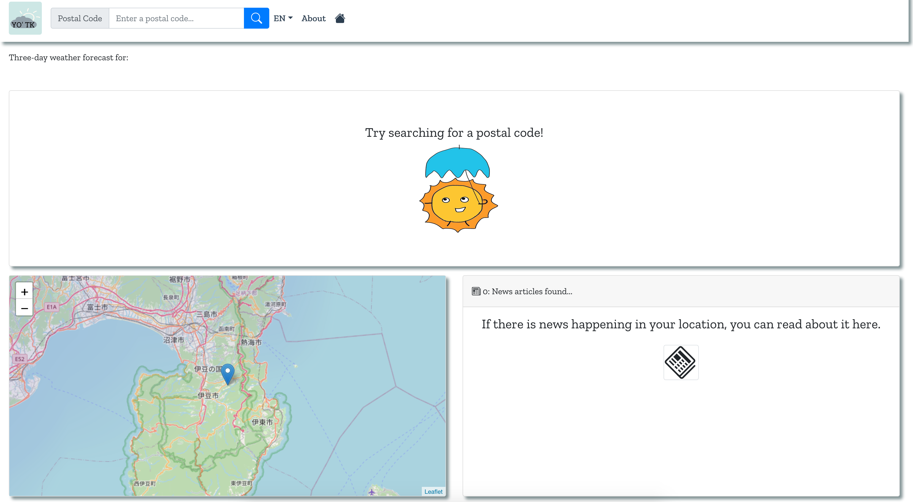
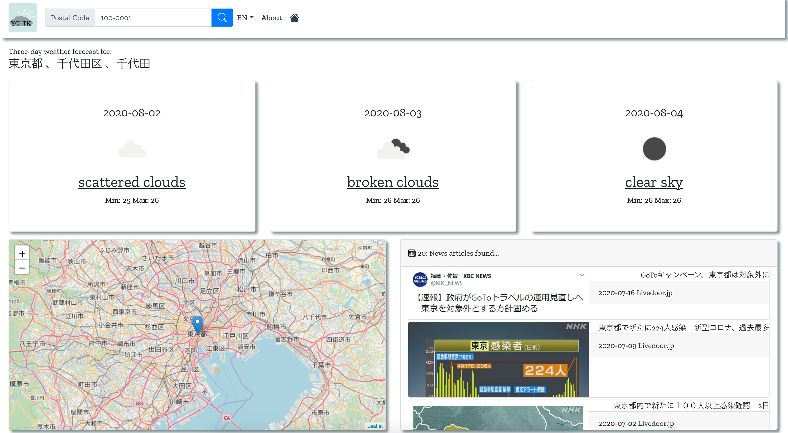
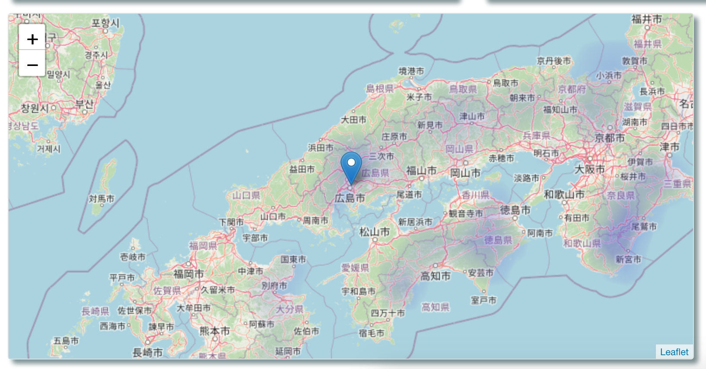
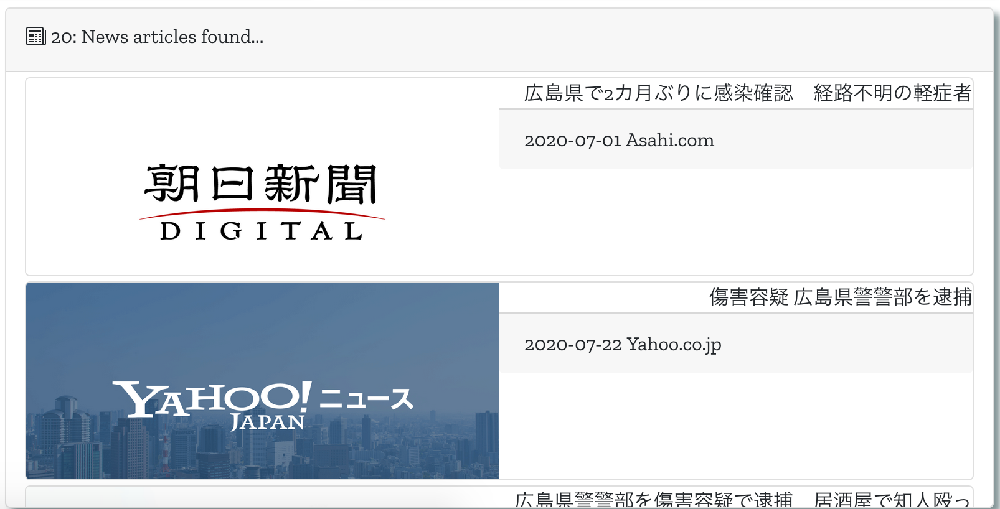
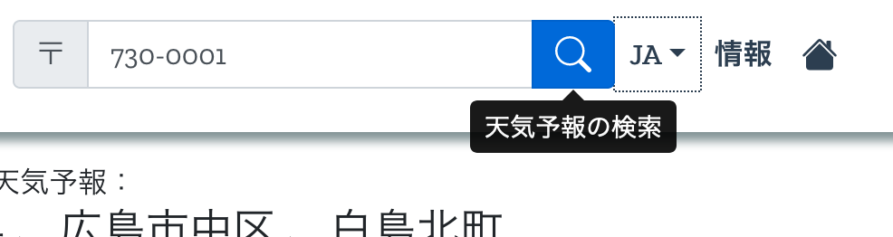

# Yo' Tenki


[](https://travis-ci.org/ClarkAllen1556/yotenki)

Web development programming assessment.

This site is currently being hosted via Digital Ocean at [yotenki.urbanlife.me](https://yotenki.urbanlife.me/?#).

This site was developed using JavaScript, Vue.js, and Bootstrap-vue; it was also initialized using the Vue CLI If you wish to run the project your self, please follow the instructions below.

## Install project dependencies

``` bash
yarn install
```

### Serve a local instance of the web application (hot-reload)

``` bash
yarn serve
```

### Build the application for distribution

``` bash
yarn build
```

## Screenshots

> Home screen


---
> Weather forecast


---
> Bilingual support (Japanese, English)


---
> Working radar map


---
> Location based news feed


---
> Accessibility

